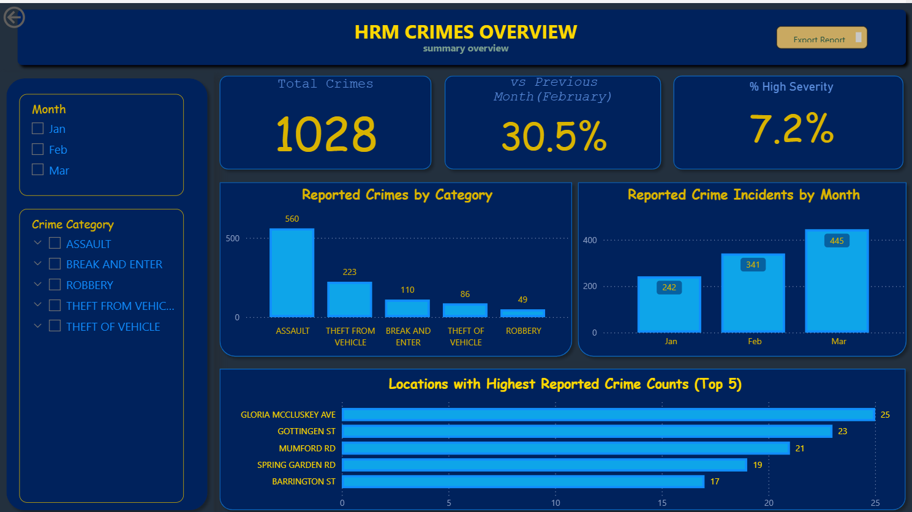
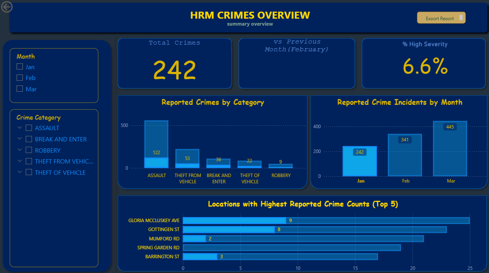
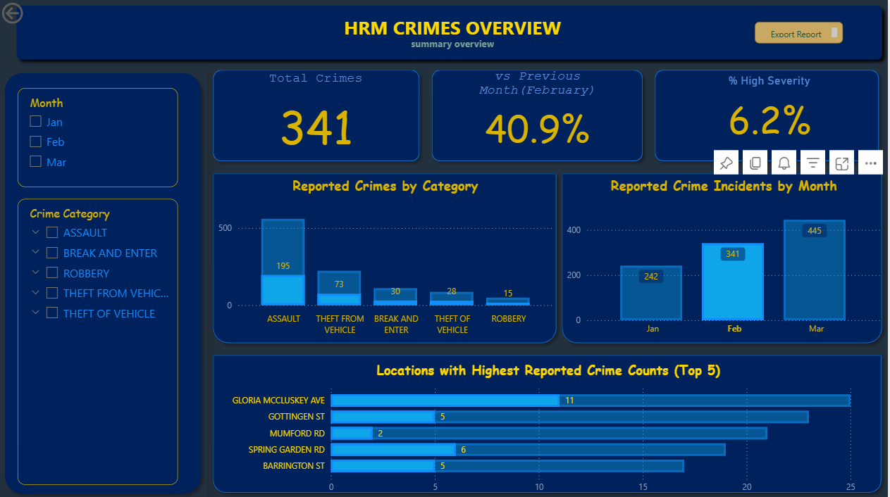
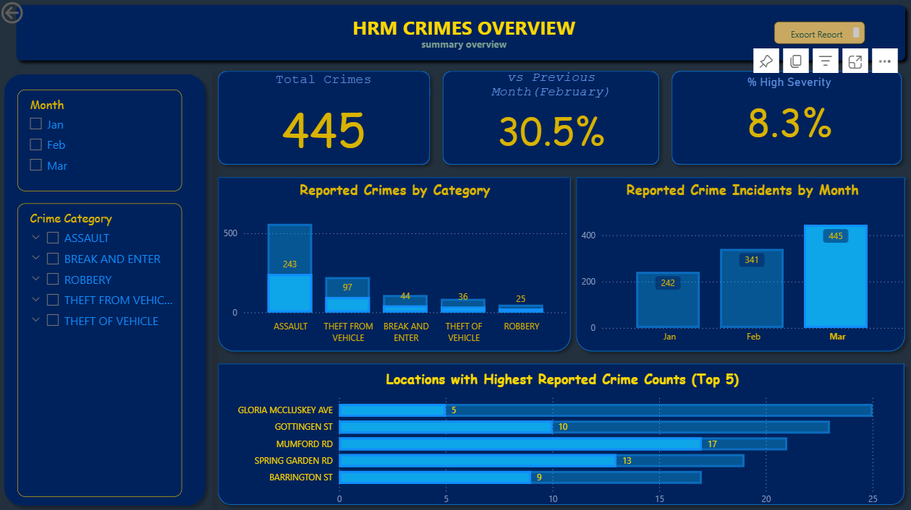
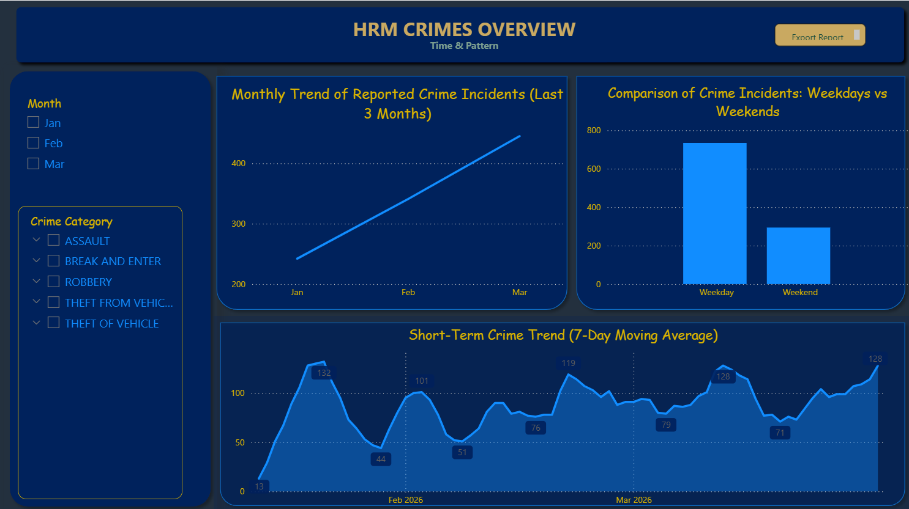
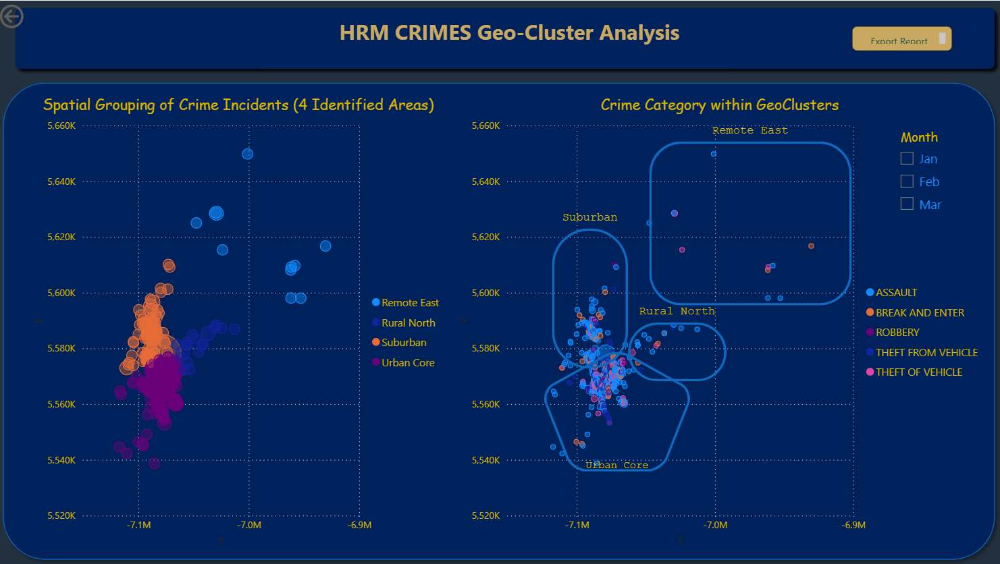
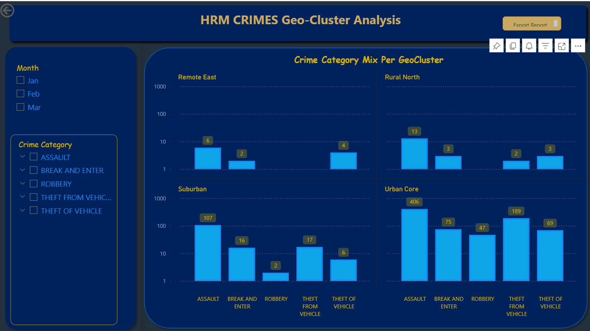
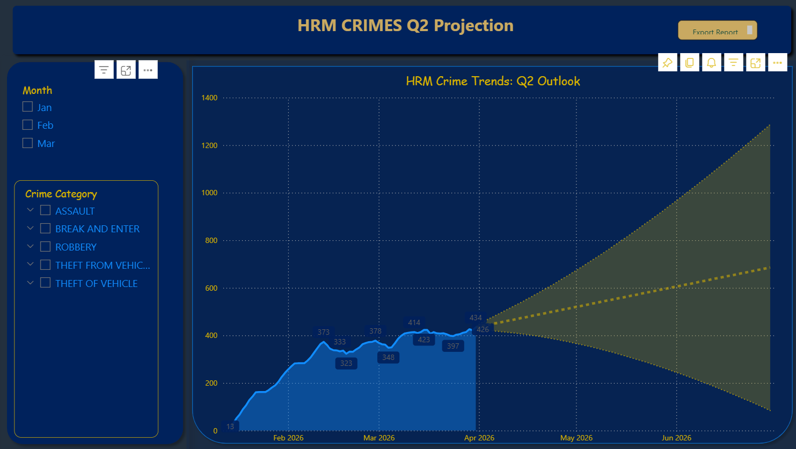
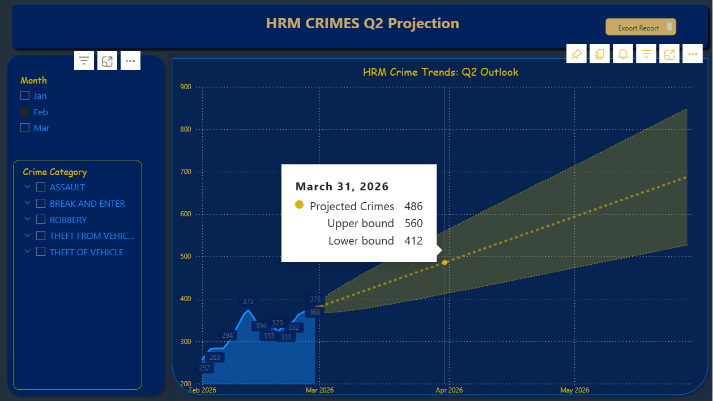
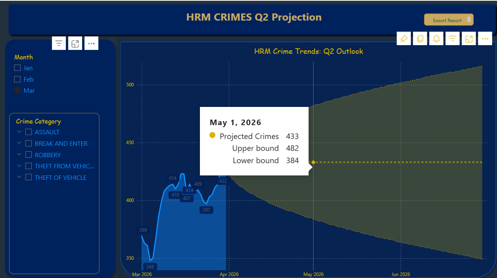

# 🔍 HRM Crime Analytics
### *A full-stack data analytics project on general occurrence crimes in Halifax Regional Municipality, Nova Scotia*

---

## Badges


---

## 📥 Project Files

| File | Description |
|---|---|
| [⬇️ Download Crime_Analytics.pbix](https://github.com/Anne-Wambaire-Mwangi/HRM-Crimes/raw/main/Crime_Analytics%20.pbix) | Power BI report - open in Power BI Desktop |
| [⬇️ Download Crime_Analytics.pdf](https://github.com/Anne-Wambaire-Mwangi/HRM-Crimes/raw/main/Crime_Analytics.pdf) | Static PDF export of all dashboard pages |
| [⬇️ Download Halifax_Crime.dtsx](https://github.com/Anne-Wambaire-Mwangi/HRM-Crimes/raw/main/ETL/Halifax_Crime.dtsx) | SSIS ETL package |
| [⬇️ Download HRM_Clustering.ipynb](https://github.com/Anne-Wambaire-Mwangi/HRM-Crimes/raw/main/Python/HRM_Clustering.ipynb) | K-Means clustering notebook |

> 💡 **New to the project?** Start with the PDF for a quick visual overview, then open the `.pbix` file in Power BI Desktop to explore the interactive slicers and tooltips.

---

## 📖 Introduction

I built this project to answer a question that felt very personal to me: **is Halifax safe?**

I'm an international student, and when I arrived in Halifax I had no idea what the city was really like. I'd heard rumours that Halifax was a human trafficking hotspot, and I wanted to find out if there was any data to back that up. When I went looking, I couldn't find human trafficking data but I found something else: the HRM Open Data Hub publishes a rolling 7-day dataset of general occurrence crimes. I got curious. I decided to collect it, store it, and analyse it properly.

What started as a personal safety question turned into a full data engineering and analytics project - an ETL pipeline, a relational data warehouse, unsupervised machine learning, and an interactive Power BI report.

This is that project.

---

## 📌 Table of Contents

1. [Introduction](#-introduction)
2. [The Data](#-the-data)
3. [Tech Stack & Architecture](#-tech-stack--architecture)
4. [The Process (How I Built It)](#-the-process-how-i-built-it)
5. [Dashboard Summary](#-dashboard-summary)
6. [Key Insights](#-key-insights)
7. [Recommendations](#-recommendations)
8. [Purpose & Audience](#-purpose--audience)
9. [What I Learned](#-what-i-learned)
10. [Future Improvements](#-future-improvements)
11. [Data Limitations & Known Gaps](#-data-limitations--known-gaps)

---

## 📦 The Data

**Source:** (https://data-hrm.hub.arcgis.com/datasets/f6921c5b12e64d17b5cd173cafb23677_0/explore?location=44.686932%2C-63.228361%2C9)

The dataset covers **general occurrence crimes** - the broadest category of police-reported incidents in HRM. The catch is that it's published as a **7-day rolling window** - only the last 7 days are ever publicly available, and there's no historical archive.

So I built one myself. I manually downloaded the CSV every other day starting January 14, 2026, and loaded each file through my SSIS pipeline into a SQL Server data warehouse. It's not glamorous, but it's how you build longitudinal data when the source doesn't give it to you.

**The raw source columns I worked with:**

| Column | Description |
|---|---|
| `OBJECTID` | Source record identifier |
| `EVT_RT` | Event reporting type code (e.g. `GO` = General Occurrence) |
| `EVT_RIN` | Event record identification number |
| `EVT_DATE` | Date of the reported incident |
| `LOCATION` | Street address or intersection |
| `RUCR` | Crime classification code (numeric) |
| `RUCR_EXT_D` | Crime type description |
| `x` | Longitude coordinate (projected) |
| `y` | Latitude coordinate (projected) |

**Coverage:** January 14, 2026 – March 2026 (68 days of actual data)

**⚠️ Days I missed** *(because of the 7-day rolling window - if I missed a collection day, that data was gone)*:
- January: Jan 1–13 (before I started), Jan 24, Jan 25
- February: Feb 5, Feb 6, Feb 13
- March: Mar 4, Mar 10, Mar 16, Mar 17

I want to be transparent about this. When you see sharp dips in the 7-day moving average chart, check this list first - it may be a collection gap, not a real drop in crime.

---

## 🛠 Tech Stack & Architecture

```
HRM Open Data Hub (CSV, 7-day rolling)
        │
        ▼
┌─────────────────────────────┐
│   SSIS Package (Visual      │
│   Studio / SQL Server IS)   │
│   Halifax_Crime.dtsx        │
│                             │
│  ┌─────────────────────┐    │
│  │ Enumerate Crime Data│    │  ← Foreach Loop over CSV files
│  │ → Staging Crime Data│    │  ← Flat File Source → stg.HalifaxCrime
│  └─────────────────────┘    │
│  ┌─────────────────────┐    │
│  │ Dims Container      │    │
│  │ → dim.Crime         │    │  ← Incremental load (NOT IN subquery)
│  │ → dim.Event         │    │
│  │ → dim.Location      │    │
│  └─────────────────────┘    │
│  ┌─────────────────────┐    │
│  │ Fact Load           │    │  ← fact.CrimeIncidents
│  └─────────────────────┘    │
│  ┌─────────────────────┐    │
│  │ RPTS Container      │    │  ← Pre-aggregated reporting tables
│  │ → rpt.ByCategory    │    │
│  │ → rpt.ByLocation    │    │
│  │ → rpt.BySeverity    │    │
│  └─────────────────────┘    │
└─────────────────────────────┘
        │
        ▼
┌─────────────────────────┐
│  SQL Server (SSMS)      │
│  Database: HRM_Crime    │
│  Star Schema            │
└─────────────────────────┘
        │
        ├──────────────────────────────────────┐
        ▼                                      ▼
┌──────────────────┐                 ┌──────────────────────┐
│  Python /        │                 │  Power BI            │
│  Jupyter         │                 │  (Direct query from  │
│  Notebook        │                 │   SSMS + Python CSV) │
│                  │                 │                      │
│  K-Means         │                 │  5 Report Pages      │
│  Clustering      │                 │  DAX Measures        │
│  (k=4, X/Y only) │                 │  DAX Calendar Table  │
│                  │                 │  Forecasting         │
│  → GeoCluster    │────────────────▶│                      │
│    CSV export    │                 └──────────────────────┘
└──────────────────┘
```

---

## ⚙️ The Process (How I Built It)

### Phase 1 - Business Understanding 

My starting question was simple: *is Halifax safe?* I'm an international student with no local knowledge, and I wanted an evidence-based answer rather than just vibes and word of mouth. I originally went looking for human trafficking data specifically - but when that wasn't available, I redirected to the general occurrence crimes dataset, which turned out to be rich enough to answer much broader questions.

**What I set out to understand:**
- What types of crimes are being reported in HRM, and how many?
- Where are crimes concentrated geographically?
- Are there patterns by time - month, day of week, week of month?
- Where is crime headed in Q2 2026 based on what I've collected?
- How do I build something that gets better as I collect more data?

---

### Phase 2 - Data Understanding & Collection

The HRM Open Data Hub refreshes the crime CSV on a 7-day rolling basis with no historical retention. Since I needed longitudinal data, I set up a manual collection protocol: download the CSV every other day, save it with a consistent naming convention, and drop it in my pipeline input folder.

**A few things I noticed early on:**
- The `OBJECTID` field is defined as a 1-byte signed integer (`i1`) in the source - this caused a **datatype mismatch** for one record where the value exceeded the 1-byte range. That record gets redirected by my pipeline rather than silently dropped, and it shows up in the ETL Operational dashboard so I can see it.
- Some physical locations appear multiple times with slightly different coordinates - which is why 1,028 incidents map to only 795 unique coordinate points and 503 unique street addresses.
- The `EVT_RT` field only ever contains `GO` (General Occurrence) in this dataset. I built the data model to accommodate future event types anyway - so if HRM ever publishes other event categories, the pipeline can handle them without restructuring.

---

### Phase 3 - ETL Pipeline (SSIS + SQL Server)

I built the entire ETL pipeline as a single SSIS package (`Halifax_Crime.dtsx`) connected to a SQL Server database called `HRM_Crime`. Here's how it runs:

**Step 1 - Enumerate Crime Data (Foreach Loop Container)**
Rather than hardcoding a file path, I used a Foreach Loop container that iterates over every CSV in the source folder and dynamically binds each file path to a package variable (`User::crimevariable`). This means I can drop any number of new CSVs in the folder and run the package once - it processes all of them.

**Step 2 - Staging (`stg.HalifaxCrime`)**
Each CSV lands in a staging table first via a Flat File Source → OLE DB Destination data flow. I set error rows to redirect rather than fail - so if something like the OBJECTID overflow happens, the pipeline keeps running and logs the bad record separately for review.

**Step 3 - Dimension Loading (`Dims` Sequence Container)**
I load three dimension tables from staging using incremental logic. Each one checks what already exists using a `NOT IN (SELECT key FROM dim.Table)` subquery, so I can re-run the pipeline as many times as I want without creating duplicates.

- **`dim.Crime`** - `Crime_ID`, `Crime_Classification_Code`, `Crime_Category`, `Crime_Type`, `Crime_Subcategory`, `Crime_Severity_Level`
- **`dim.Event`** - `Event_ID`, `Event_Reporting_Type` (`GO`), `Event_Type_Description` (`General Occurrence`). I used a `lup.Event_ID` lookup table here to future-proof for other event types
- **`dim.Location`** - Location keys and street address fields

**Step 4 - Fact Table Loading**
`fact.CrimeIncidents` is my central table - one row per incident, with foreign keys pointing to all the dimension tables, plus the date key, raw coordinates (x, y), and the source record identifier.

**Step 5 - Reporting Tables (`RPTS` Sequence Container)**
I pre-aggregate the fact table into reporting tables by category, location, and severity. This gives Power BI a lighter layer to query for standard summary visuals rather than hitting the fact table directly every time.

**Step 6 - Calendar Table (DAX, Power BI)**
Instead of building a date dimension in SQL, I generated a Calendar table directly in Power BI using DAX. It spans roughly 6 years and includes year, month, week number, and weekday/weekend flags - everything I needed for the time intelligence measures and forecasting.

---

### Phase 4 - Machine Learning (Python / Jupyter)

I used Python to cluster the crime data geographically - I wanted to see if there were natural spatial groupings in HRM that the data would reveal on its own.

**Libraries I used:** `pandas`, `numpy`, `matplotlib`, `seaborn`, `plotly`, `scikit-learn`, `kneed`

**My process:**
1. Exported the data from SQL Server and loaded it into a Pandas DataFrame
2. Selected only `x` and `y` as features - I wanted pure geographic clustering with no crime-type information influencing the result
3. Standardised the coordinates with `StandardScaler` so neither axis dominated due to scale differences
4. Ran the elbow method (inertia across k=1–10) and used `KneeLocator` from the `kneed` library to identify the optimal k - it confirmed **k=4**
5. Validated the result with a **silhouette score**
6. Fitted `KMeans(n_clusters=4)` on the scaled coordinates
7. Assigned the cluster labels back to my original DataFrame
8. Exported a CSV with: `Date`, `Crime_Classification_Code`, `Crime_Category`, `location`, `x`, `y`, `GeoCluster`

**I named the clusters myself** based on my knowledge of HRM's geography:

| Cluster Label | Geographic Area | Crime Profile |
|---|---|---|
| Urban Core | Downtown Halifax/Dartmouth peninsula | All 5 crime types, highest density |
| Suburban | Bedford, Clayton Park, suburban Dartmouth | Property crime more prominent |
| Rural North | Fall River, Sackville corridor | Low volume, assault-dominant |
| Remote East | Eastern Passage, Lawrencetown | Isolated incidents, 3 crime types only |

I then imported this CSV into Power BI alongside my SQL Server data and built the Geo-Cluster Analysis pages from it.

---

### Phase 5 - Power BI Reporting

I connected Power BI directly to my SQL Server instance for the warehouse data and imported the Python clustering CSV separately. I modelled the relationships between all tables in the data model view and wrote DAX measures for everything - KPIs, month-over-month comparisons, severity percentages, the 7-day moving average, and the Q2 forecast with confidence bounds.

The final report has **5 pages**, each with month and crime category slicers that cross-filter all visuals dynamically.

---

## 📊 Dashboard Summary

> 💡 Open the [`.pbix` file](https://github.com/Anne-Wambaire-Mwangi/HRM-Crimes/raw/main/Crime_Analytics%20.pbix) in Power BI Desktop to interact with the slicers and tooltips. The [PDF](https://github.com/Anne-Wambaire-Mwangi/HRM-Crimes/raw/main/Crime_Analytics.pdf) is a good starting point if you just want a quick read-through.

---

### Page 1 - ETL Operational Reporting

This is my pipeline health check page - it's for me and anyone working on the data engineering side, not for end users. It shows record counts across all key tables so I can verify the pipeline ran correctly after each load. If any number here looks off, check the pipeline logs before digging into the analytical pages.

**What it shows:** 1,028 crime records · 12 crime types · 5 categories · 795 unique coordinate points · 503 unique locations · 68 days of data · 1 error record (OBJECTID datatype overflow - redirected and logged, not silently dropped)

---

### Page 2 - Summary Overview

This is the main page I built for anyone who wants the big picture fast. Three KPI cards at the top, a category breakdown, a monthly trend, and the top 5 locations - all sliceable by month and crime category.

---

#### All Months (Combined View)



Across all three months I have data for, there were **1,028 reported crimes**. Assault is by far the dominant category at 560 incidents - that's 54.5% of everything, more than double the next category. Crime grew every single month without exception. Gloria McCluskey Ave is the top hotspot at 25 incidents over the period, followed by Gottingen St (23) and Mumford Rd (21).

| Metric | Value |
|---|---|
| Total Crimes | 1,028 |
| vs Previous Month (Feb) | +30.5% |
| % High Severity | 7.2% |

---

#### January - Filtered View



January was my lowest month at **242 crimes**. Assault was already at 50% of the total from day one. Gloria McCluskey Ave and Gottingen St established themselves as hotspots immediately. The "vs Previous Month" KPI is blank here - that's correct behaviour, there's no prior month in my dataset.

| Metric | Value |
|---|---|
| Total Crimes | 242 |
| vs Previous Month | - |
| % High Severity | 6.6% |

---

#### February - Filtered View



February saw the **sharpest jump** in my dataset - a 40.9% increase to 341 crimes. What I found interesting here is that high severity actually *dropped* to 6.2% even though total volume was up. More crimes, but proportionally fewer serious ones. Gloria McCluskey Ave surged to 11; Spring Garden Rd entered the top 5 for the first time. Mumford Rd dropped to just 2 - its January numbers didn't repeat.

| Metric | Value |
|---|---|
| Total Crimes | 341 |
| vs Previous Month (Jan) | +40.9% |
| % High Severity | 6.2% |

---

#### March - Filtered View



March is the most concerning month in my data. Not only was it the highest volume at **445 crimes**, but severity also hit its peak at 8.3% - meaning both the number of crimes and the seriousness of those crimes went up at the same time. That's the combination I was most worried about seeing. Mumford Rd jumped from 2 incidents to 17 - the single biggest location-level shift in my entire dataset.

| Metric | Value |
|---|---|
| Total Crimes | 445 |
| vs Previous Month (Feb) | +30.5% |
| % High Severity | 8.3% |

---

### Page 3 - Time & Pattern



I built this page to dig into the *when* of crime in HRM.

**Monthly Trend (top left):** The linear climb from Jan to Mar is steady and unbroken - this isn't a spike, it's a sustained upward shift, which I find more meaningful than a one-time surge.

**Weekday vs Weekend (top right):** This one surprised me. About **72% of crimes happen on weekdays** - not weekends. My interpretation is that many property crimes (break & enters, vehicle thefts) get *discovered and reported* during business hours, so the distribution reflects reporting behaviour as much as it reflects when crimes actually occur. Either way, weekdays are when the data concentrates.

**7-Day Moving Average (bottom):** This is my favourite visual in the whole report. The key data points: 13 (mid-Jan start, partial week) → 132 (late Jan peak) → 44 (trough) → 101 → 51 → 119 → 76 → 128 → 71 → 128 (end of March, still rising). Two things stand out to me: there's a roughly **2–3 week wave cycle** in the peaks and troughs, and the floor of each trough is rising - even the quiet weeks are getting busier.

> ⚠️ The sharp dips on Jan 24–25, Feb 5–6, Feb 13, and Mar 4/10/16–17 are **my missing collection days**, not real crime drops. See [Data Limitations](#-data-limitations--known-gaps).

---

### Page 4 - Geo-Cluster Analysis

#### Spatial Distribution & Cluster Boundaries



**Left plot:** All 795 crime coordinate points in projected coordinate space. The density collapses into a tight vertical band around the downtown Halifax/Dartmouth peninsula - the urban concentration is immediately obvious. Bubble sizes reflect incident count per coordinate point; the largest bubbles downtown confirm extreme concentration at specific addresses.

**Right plot:** The same points with my 4 K-Means clusters overlaid. I drew the boundary annotations manually to make the zones readable. The Urban Core and Rural North overlap a bit spatially - that reflects Halifax's geography, where urban transitions to semi-rural quite abruptly.

What I find most compelling about this visual is that **I only fed coordinates into the clustering model** - no crime type information at all. Yet the clusters came back criminologically coherent, with distinct crime profiles per zone. That tells me geography alone predicts crime type in HRM.

---

#### Crime Category Mix Per GeoCluster



> ⚠️ **The y-axis is logarithmic** - I made this choice deliberately. On a linear scale, the Urban Core's assault count (406) would make every other cluster invisible. The log scale lets you actually compare the patterns across all four clusters without losing the smaller ones entirely.

| Cluster | Assault | Break & Enter | Robbery | Theft from Vehicle | Theft of Vehicle | Total |
|---|---|---|---|---|---|---|
| Urban Core | 406 | 75 | 47 | 189 | 69 | **786** |
| Suburban | 107 | 16 | 2 | 17 | 6 | **148** |
| Rural North | 13 | 3 | 0 | 2 | 3 | **21** |
| Remote East | 6 | 2 | 0 | 0 | 4 | **12** |

Robbery essentially doesn't exist outside the Urban Core - it needs victim proximity that rural and suburban areas don't provide. Assault shows up everywhere, which tells me it's not a downtown-only problem. Property crimes start creeping into the suburbs, which I think is worth watching as HRM grows.

---

### Page 5 - Q2 Projection

I built this forecast entirely in Power BI using DAX measures. The **solid blue area** is my actual observed data, the **dashed yellow line** is the point forecast, and the **olive shaded cone** is my confidence interval. The cone gets wider the further out you project - I kept it that way intentionally because I think it's dishonest to show a narrow confidence interval when you only have 68 days of training data.

---

#### Full Dataset Projection (Jan–Jun 2026)



With all my data included, the projection extends from my observed plateau (~397–434 in late March/early April) through to June 2026. The upper bound approaches ~1,400 by June and the lower bound drops near ~200 - that wide cone is the honest reality of projecting 3 months ahead from limited data.

---

#### February Baseline Projection



This shows what the forecast looked like if I'd only had February data. The tooltip at **March 31, 2026** reads: Projected **486** · Upper **560** · Lower **412**. If I'd stopped collecting in February, I would have projected a moderate Q2 - March proved that estimate was too optimistic.

---

#### March Baseline Projection *(most current and actionable)*



This is the view I trust most right now. Based on March alone, the tooltip at **May 1, 2026** reads: Projected **433** · Upper **482** · Lower **384**. The cone is tighter and the trajectory is relatively flat - suggesting a possible **plateauing in the 400–480 crimes/month range** through Q2. The lower bound never drops below March's observed floor, which I interpret as the model treating March's activity level as the new baseline minimum.

---

## 💡 Key Insights

1. **Assault accounts for ~54% of all reported incidents and shows up in every geographic cluster.** It is not a downtown-only problem - it follows people regardless of where they live.

2. **Crime grew every single month I have data for** - January (242) → February (341, +40.9%) → March (445, +30.5%). The rate of growth is slowing, but volume is still rising.

3. **March was the most alarming month** - highest volume AND highest severity (8.3%) at the same time. That combination is the signal I was most watching for.

4. **72% of reported crimes happen on weekdays.** If you're planning resource allocation around weekends, the data doesn't support that.

5. **The Urban Core is where crime concentrates** - 72% of assaults, 85% of theft from vehicle, and 96% of robberies all happen there. If you want impact, that's where to focus.

6. **Robbery is almost exclusively an Urban Core phenomenon** - zero robbery incidents in Rural North or Remote East over the full period.

7. **Mumford Road went from 2 incidents in February to 17 in March** - the biggest single location shift in my data. I think this could indicate geographic displacement and it's worth watching closely.

8. **All top 5 crime locations are urban corridor streets, not residential areas.** Crime concentrates on busy thoroughfares, not in neighbourhoods.

9. **The 7-day moving average shows a cyclical 2–3 week pattern with rising troughs** - even the quiet weeks are getting busier over time.

10. **My K-Means model used only coordinates - no crime type data at all - and still produced criminologically distinct clusters.** That tells me geography is a strong natural predictor of crime type in HRM.

---

## 🧭 Recommendations

> I want to be clear: these are data-informed suggestions, not policy directives or criminological conclusions. They come directly from what I found in the numbers, and they're intended for different people who might read this project.

---

### 🏠 For Newcomers & International Students

If you're new to Halifax like I was, here's what the data actually says - not rumour, not feeling, actual reported incidents:

- **The five highest-incident locations** are Gloria McCluskey Ave, Gottingen St, Mumford Rd, Spring Garden Rd, and Barrington St. These are all busy urban corridors - treat them with the same awareness you'd bring to any high-traffic city street, especially on weekdays when incidents peak.

- **Assault is everywhere** - 54% of all crimes and present in every cluster including rural areas. Staying aware of your surroundings matters regardless of which part of the city you're in, not just downtown.

- **96% of robberies happen in the Urban Core.** If you're out in the downtown area, be mindful of your belongings, especially on quieter side streets.

- **Weekdays see 72% of reported crimes.** The city isn't safer just because it's a weekday.

- Crime is growing month over month, **Stay informed, not afraid.** I built this project partly for people like me who just wanted to know the real picture.

---

### 🏘️ For Residents & Community Members

- **Mumford Road's jump from 2 to 17 incidents in a single month** is the sharpest location-level change I've seen. If you live or work in that corridor, now is a good time to be paying attention and engaging with local community safety channels.

- **Property crime is creeping into the suburbs.** Break & Enter and Theft from Vehicle are growing as a share of crime outside the Urban Core - if you're in Bedford, Clayton Park, or suburban Dartmouth, your vehicle and property security matters more than it might have a year ago.

- **Even the Rural North and Remote East clusters have incidents**, mostly assault. No area is completely without risk - community vigilance is relevant everywhere.

- If your area is seeing rising numbers, consider getting involved with or supporting **Neighbourhood Watch programs**.

---

### 👮 For Law Enforcement & Public Safety Planners

- **The Urban Core is your highest-leverage target.** It accounts for 72% of assaults, 85% of theft from vehicle, and 96% of robberies. Concentrated patrol presence and intervention resources in the downtown peninsula will have disproportionate impact on the overall numbers.

- **The data supports weekday-weighted deployment.** 72% of incidents happen Monday–Friday. Patrol and outreach programs concentrated on weekday coverage are better aligned with reality than weekend-heavy schedules.

- **The 2–3 week cyclical pattern in my moving average** suggests crime isn't random - there may be behavioural or environmental rhythms driving the peaks. Investigating what's different during peak weeks (events, weather, end-of-month factors) could enable proactive rather than reactive deployment.

- **March is a warning sign.** It's the first month where both volume and severity rose simultaneously. I'd want to understand whether current resource levels are calibrated for this trajectory before Q2 progresses further.

- **Robbery's near-total Urban Core concentration** (47 of 49 incidents) makes it a strong candidate for a micro-location intervention strategy - identifying the specific streets or establishments most associated with robbery incidents could produce measurable results with targeted effort.

---

### 🏛️ For Municipal Policy Makers

- **The 7-day rolling window is a gap in HRM's own analytical capacity.** This entire project only exists because I manually collected data every other day. Publishing a historical archive - or even extending the window to 90 days - would dramatically improve the city's ability to do evidence-based public safety planning, at minimal cost.

- **Crime is on an upward trajectory** (242 → 341 → 445 across three months). My Q2 projection suggests a possible plateau in the 400–480 range, but the trend hasn't reversed. Early investment in prevention is more cost-effective than reactive enforcement after volumes climb further.

- **Suburban property crime is emerging.** As HRM's suburban population grows, demand for policing coverage outside the Urban Core is likely to grow with it. The data is already showing the early signs.

- **Open data enables community-led analysis.** I built something meaningful on what's publicly available. If HRM expanded what it publishes - even just adding time of day or incident resolution status - the quality of analysis that residents, researchers, and planners could do would improve significantly.

---

> 📌 *All recommendations are based on data collected between January 14 and March 2026 (68 days). I'll revisit and update these as more data comes in.*

---

## 🎯 Purpose & Audience

**I built this for:**
- Data analysts and engineers who want to see how I designed and implemented the full pipeline
- Teammates or collaborators who need to understand, reproduce, or extend what I've built
- Public safety researchers interested in HRM-specific crime patterns
- Fellow international students or newcomers to Halifax who want an evidence-based picture of the city

**What this project is not:**
- It's not a criminology study - I'm not making causal claims about why crimes happen where they do
- It's not a real-time system - collection is manual and there are gaps
- It's not a law enforcement tool - everything here comes from publicly available reported crime data

---

## 🎓 What I Learned

**Technical:**
- Designing a full star schema from scratch - staging, lookup, dimension, fact, and reporting layers - and really understanding why each one exists rather than just following a template
- Writing incremental SSIS data flows that are genuinely safe to re-run, not just ones that *usually* work
- What happens when a datatype in your flat file source doesn't match what SQL Server expects - and how to handle it gracefully with error redirection rather than letting the whole pipeline fail
- Why you need `StandardScaler` before K-Means and what goes wrong if you skip it
- How to use the elbow method and silhouette score together to make a defensible choice of k - not just picking a number
- Writing DAX measures for moving averages, period-over-period comparisons, and forecast confidence intervals from scratch
- Connecting Power BI to multiple data sources and managing cross-source relationships in the data model

**Analytical:**
- When a logarithmic axis is the right call and how to explain that choice clearly
- That weekday/weekend crime distributions don't work the way intuition suggests - reported crime follows reporting behaviour, not just occurrence
- That clustering purely on geography, with no crime-type labels, can still produce criminologically meaningful results
- How to communicate forecast uncertainty honestly rather than projecting false confidence

**Personal:**
- A question that starts with *"am I safe here?"* is one of the most motivating ways I've ever learned a technical stack. I cared about the answer, so I cared about getting the method right.
- Manual data collection is tedious - but it gives you a respect for data provenance that automated pipelines don't teach you in the same way
- The best documentation is the kind you'd want to find if you were joining someone else's project.

---

## 🚀 Future Improvements

- **Automate data collection** - Replace my manual daily downloads with a scheduled task or API call, so I never miss another day
- **Add weather data** - I want to test whether Halifax's weather (temperature, precipitation, daylight hours) correlates with crime volume
- **Time-of-day analysis** - The current dataset only has dates, not times. If HRM ever publishes hourly data, I want to build a time dimension
- **Predictive modelling** - Move from trend forecasting to ARIMA or Prophet as I accumulate more months of data
- **Fix the "vs Previous Month" label** - It's currently hardcoded to say "February." I need to update the DAX measure to dynamically reflect the comparison month
- **Robbery micro-location analysis** - With 47 of 49 robberies in the Urban Core, I think proximity analysis could pinpoint the specific micro-locations driving that cluster

---

## ⚠️ Data Limitations & Known Gaps

| Limitation | Impact | What I did about it |
|---|---|---|
| 7-day rolling source window | Can't go back and fill missing days | Documented every gap in this README |
| Missing collection days | Artificial dips in 7-day moving average | Flagged throughout the Time & Pattern section |
| No time-of-day field | Can't analyse peak crime hours | Flagged as a future improvement |
| Single event type (`GO`) | Can't distinguish sub-event types | Built the data model to handle future types |
| 1 error record (OBJECTID overflow) | Excluded from analysis | Surfaced in the ETL Operational dashboard |
| Coordinate duplication | 1,028 incidents → 795 unique points | Acknowledged and documented |
| Only 68 days of data | Wide forecast confidence intervals | Kept the confidence cone wide - it's honest |
| No demographic data | Can't analyse victim or offender profiles | Outside scope; public dataset limitation |

---

## 📁 Repository Structure

```
HRM-Crime-Analytics/
│
├── ETL/
│   └── Halifax_Crime.dtsx               # SSIS package (Visual Studio)
│
├── Python/
│   └── HRM_Clustering.ipynb             # K-Means clustering notebook
│
├── Crime_Analytics.pbix                 # Power BI report file
├── Crime_Analytics.pdf                  # Static dashboard export
│
├── Data/
│   └── *.csv                            # Raw collected CSVs (gitignored if sensitive)
│
├── Exports/
│   └── cluster_output.csv               # Python → Power BI bridge file
│
├── Screenshots/
│   ├── 01_summary_overview_all.png
│   ├── 02_summary_overview_january.png
│   ├── 03_summary_overview_february.png
│   ├── 04_summary_overview_march.png
│   ├── 05_time_and_pattern.png
│   ├── 06_geo_cluster_spatial.png
│   ├── 07_geo_cluster_category_mix.png
│   ├── 08_q2_projection_all.png
│   ├── 09_q2_projection_feb_baseline.png
│   └── 10_q2_projection_march_baseline.png
│
└── README.md
```

---

## 👩🏾‍💻 About Me

I'm **Anne Wambaire Mwangi** - an international student and data analyst who turned *"is Halifax safe?"* into a full data engineering project.

GitHub: [@Anne-Wambaire-Mwangi](https://github.com/Anne-Wambaire-Mwangi)

---

## 📄 License

This project uses publicly available data from the [HRM Open Data Hub](https://data-hrm.hub.arcgis.com/datasets/f6921c5b12e64d17b5cd173cafb23677_0/explore?location=44.686932%2C-63.228361%2C9)). All analysis, code, and documentation are my own original work.

---

*Last updated: April 2026 | Data collection ongoing*
